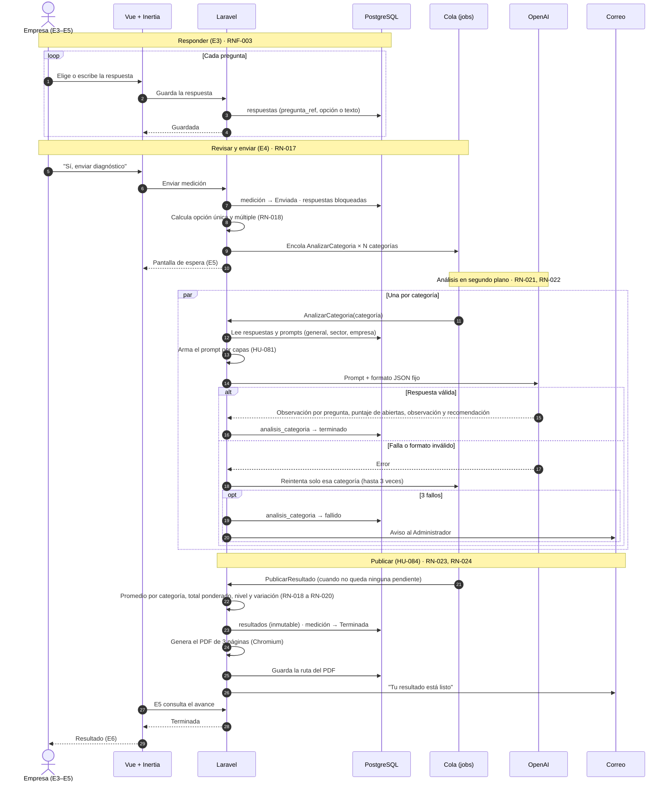
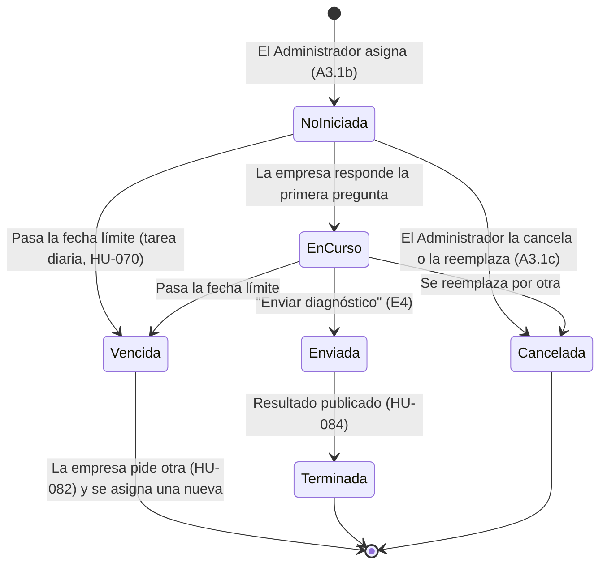
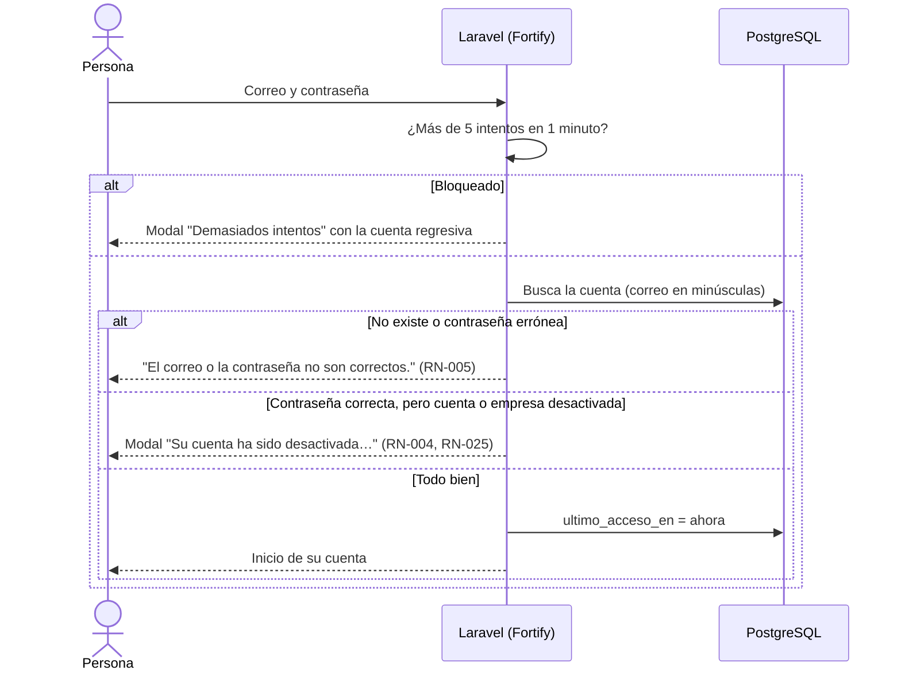
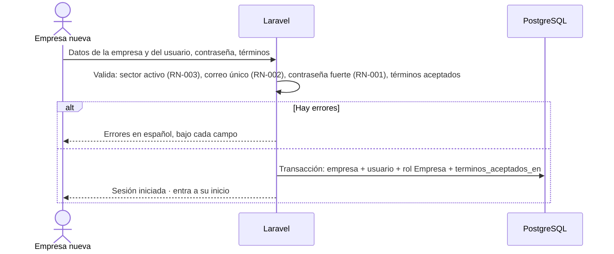
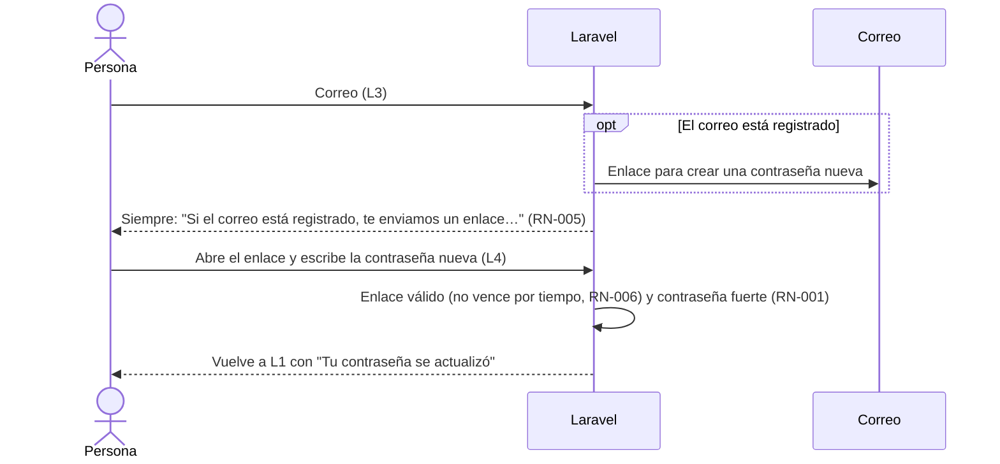

# Flujos del sistema

**Estado:** EN CURSO (T-042). El flujo de la medición (sección 1) es el **diseño** que se implementa en la semana 5; los flujos de acceso (sección 3) ya están construidos.

Los diagramas están en Mermaid; GitHub los dibuja solos. Los nombres de clases y trabajos (`AnalizarCategoria`, `PublicarResultado`…) son una **propuesta** para el backend.

## 1. De responder a ver el resultado

Es el flujo principal del sistema: la empresa responde, envía, la IA analiza cada categoría en segundo plano y el resultado se publica sin revisión (RN-023).

Puntos clave:

- **Nada bloquea la pantalla (RNF-004).** El envío solo cambia el estado y encola trabajos; la empresa puede salir de E5.
- **Cada categoría es independiente.** Si una falla, las demás conservan su análisis (HU-069 CA-004).
- **El PDF se genera una sola vez** con lo guardado, sin volver a llamar a la IA (RN-024).
- **[FUNCIONALIDAD POR DEFINIR]** Qué ve la empresa si una categoría queda fallida tras 3 intentos. El wireframe A4 dice: "la categoría queda 'pendiente de análisis' y el resultado se recalcula al reintentar". Falta decidir si el resultado se publica sin esa categoría o espera a que el Administrador la reintente.

## 2. Estados de la medición

- Solo hay una medición pendiente por empresa (RN-014). Asignar otra reemplaza la pendiente.
- "Cancelada" viene de los wireframes A3.1c; está en la revisión del MER (`12_BASE_DE_DATOS.md`).

## 3. Acceso (construido)

### Iniciar sesión (L1)

### Registrar la empresa (L2)

### Recuperar la contraseña (L3 y L4)

## 4. Tareas programadas (semana 5)

| Tarea | Cuándo | Qué hace |
|---|---|---|
| Marcar vencidas (HU-070) | Cada día | Pasa a "Vencida" las mediciones sin enviar cuya fecha límite ya pasó |
| Resumen semanal | Cada semana | Envía al Administrador las mediciones pendientes, si lo activó en Mi perfil (A6) |

**[INFORMACIÓN PENDIENTE]** La hora de la tarea diaria y el día del resumen semanal.
