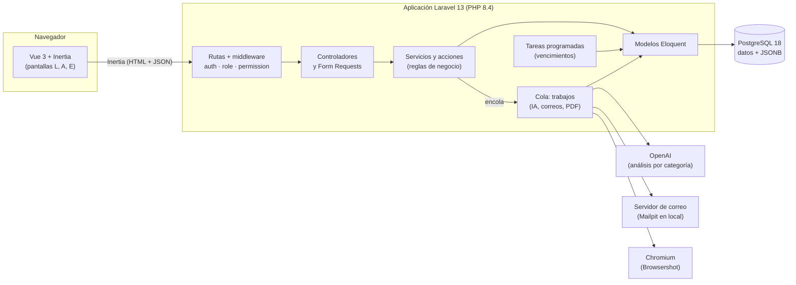

# Arquitectura

**Estado:** EN CURSO (T-063). Describe lo que ya existe y cómo se organizan los módulos que faltan.

## En una frase

Es un **monolito modular**: una sola aplicación Laravel con Vue adentro (Inertia), una base de datos PostgreSQL y cuatro servicios externos. No hay una API aparte ni varios servidores que coordinar (propuesta técnica, sección 3).

## Diagrama general



El bot de WhatsApp está aplazado. Si se retoma, vive en la misma aplicación pero en tablas y rutas separadas (RN-029).

## Capas

| Capa | Qué hace | Dónde |
|---|---|---|
| **Pantallas** | Muestran los datos y envían formularios. **No calculan reglas de negocio.** | `resources/js/pages`, `components`, `layouts` |
| **Rutas y middleware** | Deciden quién entra: sesión, rol, permiso, cuenta activa, límite de intentos | `routes/`, `bootstrap/app.php`, `app/Http/Middleware` |
| **Controladores** | Reciben la petición, piden los datos y devuelven la página de Inertia o una redirección | `app/Http/Controllers` |
| **Validación** | Reglas de cada formulario y mensajes en español | `app/Http/Requests`, `app/Rules`, `lang/es` |
| **Servicios y acciones** | Las reglas de negocio: crear la empresa, calcular puntajes, armar el prompt, publicar el resultado | `app/Actions`, `app/Services` |
| **Modelos** | Tablas, relaciones y consultas | `app/Models` |
| **Trabajos y tareas** | Lo que corre en segundo plano (RNF-004) o a una hora fija | `app/Jobs` (por crear), `routes/console.php` |
| **Datos** | Tablas, versiones congeladas en JSONB | PostgreSQL, `database/migrations` |

## Regla de reparto entre Laravel y Vue

Es la regla 2 de `CLAUDE.md`. **Los cálculos viven en el backend.**

| Lo hace Laravel | Lo hace Vue |
|---|---|
| Puntajes, nivel, variación y promedios (RN-018 a RN-020) | Mostrar el puntaje, el color del nivel y las gráficas |
| Validar que la importancia sume 100 % y que se pueda publicar (RN-011, RN-012) | Mostrar en vivo la suma y lo que falta, como ayuda |
| Qué puede ver y hacer cada rol (RN-007) | Ocultar del menú lo que no tiene permiso (no reemplaza al servidor) |
| Validar contraseñas, correos y formularios (RN-001, RN-002) | Mostrar los requisitos mientras se escribe |
| Textos de error definitivos | Mostrar el error bajo el campo |

**Por qué:** si el cálculo estuviera en Vue, el PDF, los correos y la API darían otro número. Con el cálculo en un solo lugar, el resultado es igual en todas partes y queda guardado (RN-023).

Lo que Vue sí calcula es solo para ayudar a escribir; el servidor lo vuelve a revisar. Ejemplos: los requisitos de la contraseña (`lib/contrasena.ts`) o "cada categoría empieza valiendo 10 %" al crear un diagnóstico.

## Módulos

Cada épica de `05_REQUISITOS_FUNCIONALES.md` es un módulo. Un módulo tiene sus páginas, sus componentes, sus controladores y sus pruebas con el mismo nombre.

| Módulo | Épica | Pantallas | Frontend | Backend |
|---|---|---|---|---|
| Acceso | EP-001 | L1–L4 | `pages/auth` | Fortify, `app/Actions/Fortify`, `FortifyServiceProvider` |
| Mi perfil | EP-009 | A6, E11 | `pages/perfil` | `PerfilController` |
| Sectores, categorías y diagnósticos | EP-003 a EP-005 | A2–A2.7 | `pages/diagnosticos`, `pages/categorias` | `DiagnosticosController`, `SectoresController`, `CategoriasController`, `app/Services/Diagnosticos` |
| Inicio del Administrador | EP-002 | A1 | `pages/inicio/Administrador.vue` (bienvenida) | `InicioController` (redirección por rol, T-048) |
| Empresas y mediciones | EP-006 | A3 | Por crear | Por crear |
| Configuración de la IA | EP-007 | A4 | Por crear | `app/Services/Ia` (prueba técnica) |
| Usuarios y roles | EP-008 | A5 | `pages/usuarios` | `UsuariosController`, `RolesController`, `RolesYPermisosSeeder` |
| Experiencia de la empresa | EP-010, EP-011 | E1–E12 | `pages/inicio/Empresa.vue` (bienvenida), `pages/colaboradores` (E12) | `InicioController`, `ColaboradoresController`; el resto por crear |
| Cálculo, IA y tareas | EP-012 | — | — | Trabajos y tareas programadas (semana 5) |

## Mapa de carpetas

```text
app/
├── Actions/Fortify/      Registro (CreateNewUser) y contraseña nueva
├── Concerns/             Reglas de validación compartidas
├── Console/Commands/     prueba:ia, prueba:pdf
├── Http/
│   ├── Controllers/      Un controlador por pantalla o grupo de pantallas
│   ├── Middleware/       Cuenta activa, límite de intentos, Inertia
│   ├── Requests/         Validación de formularios
│   └── Responses/        Respuestas propias de Fortify (RN-005)
├── Models/               User, Empresa, Sector…
├── Providers/            Configuración (contraseña, login, correo)
├── Rules/                Reglas de validación propias (TieneMayuscula)
├── Services/Ia/          Análisis de la IA
└── Support/              Listas de opciones (OpcionesPerfil)
config/diagnostico.php    Configuración propia (Administrador inicial, demo)
database/
├── migrations/           Tablas
└── seeders/              Roles y permisos, sectores, Administrador, demo
lang/es/                  Textos en español
resources/
├── css/app.css           Colores y tipografía del wireframe
├── datos-ejemplo/        JSON de las vistas previas
├── js/
│   ├── components/base/  Piezas reutilizables (botón, campo, modal…)
│   ├── components/<módulo>/  Piezas de un módulo
│   ├── layouts/          AuthLayout (L1–L4) y PanelLayout (con sesión)
│   ├── lib/              Menú, niveles, contraseña, fechas, rutas
│   ├── pages/<módulo>/   Una página por pantalla
│   └── types/            Tipos de los datos que llegan del backend
└── views/pdf/            Plantillas del PDF
routes/
├── web.php               Rutas del sistema
├── settings.php          Mi perfil
└── prueba-tecnica.php    Solo en local y pruebas
tests/
├── Feature/              Pruebas de Pest por módulo
└── (resources/js/**/*.test.ts)  Pruebas de Vitest
docs/                     Esta documentación
```

## Cómo viaja una petición

1. El navegador pide una página, por ejemplo `/mi-perfil`.
2. Laravel pasa los middleware `web`: sesión, CSRF, cuenta activa, límite de intentos e Inertia. Después pasa `auth`, y `role` o `permission` si la ruta lo pide.
3. El controlador junta los datos ya calculados y llama a `Inertia::render('perfil/MiPerfil', [...props])`.
4. La primera vez llega HTML con la página. Las siguientes, solo el JSON de las props, y Vue cambia la pantalla sin recargarla.
5. Al enviar un formulario:
   - el Form Request valida;
   - si hay error, vuelve con los mensajes bajo cada campo;
   - si todo está bien, guarda y redirige con un aviso (`Inertia::flash('toast', …)`).

Los contratos entre pantallas y controladores (qué props espera cada pantalla) están en `14_FRONTEND.md`, y las rutas en `15_BACKEND.md`.

## Decisiones que forman la arquitectura

| Decisión | Por qué | Referencia |
|---|---|---|
| Monolito con Inertia en lugar de una API REST | Una sola aplicación, sin duplicar validaciones ni rutas | DEC-001, DEC-005 |
| Versiones de diagnóstico y respuestas de la IA en JSONB | Una versión publicada no cambia aunque se edite el borrador (RN-010) | `12_BASE_DE_DATOS.md` |
| Cola en la base de datos (`QUEUE_CONNECTION=database`) | No hace falta instalar Redis; alcanza para el volumen esperado | `.env.example` |
| PDF con Chromium (Browsershot) | El PDF se ve igual que la pantalla, con las mismas gráficas | DEC-004, DEC-011 |
| Roles y permisos con spatie/laravel-permission | Roles creables con casillas (A5.1), sin código | `17_SEGURIDAD.md` |
| Archivos privados (foto y logo) servidos por una ruta | Solo los ve quien tiene permiso; no hace falta `storage:link` | `15_BACKEND.md` |

## Entornos

Solo hay entorno local (Sail) y de pruebas (CI). El sistema no se publica (`03_ALCANCE.md`). Detalle en `27_ENTORNOS.md`.
