# Base de datos

**Estado:** EN CURSO · el MER es un BORRADOR que REQUIERE VALIDACIÓN (T-007)

**Motor:** PostgreSQL 18.

Este documento tiene el modelo entidad-relación (MER) armado a partir de los wireframes y de `05_REQUISITOS_FUNCIONALES.md`.

Pasos que siguen:

- **Semana 3:**
  - Cristian revisa que cada dato que se muestra tenga dónde guardarse (T-039).
  - Luis escribe el diccionario de datos (T-040).
  - El MER se aprueba antes de crear las migraciones (hito T-044).
- **Más adelante:** se explica cada tabla con un ejemplo (T-064).

## Criterios del modelo

- **Nombres en español**, en plural y sin tildes para las tablas (`mediciones`, `categorias`). Las tablas del kit de Laravel (`users`, `jobs`, `cache`…) y las de spatie/laravel-permission conservan sus nombres.
- **Versiones congeladas:**
  - Al publicar un diagnóstico se guarda una copia completa en JSONB, en `versiones_diagnostico.contenido`.
  - Las mediciones apuntan a esa copia, nunca al borrador (RN-010).
  - Así, editar el borrador no cambia las mediciones ya asignadas.
- **Resultados inmutables:**
  - El resultado guarda los puntajes, el nivel, la variación, el análisis de la IA y el prompt exacto usado (RN-023).
  - El PDF se genera una vez y se guarda (RN-024).
- **Nada se borra si tiene datos.**
  - Sectores, categorías, diagnósticos y cuentas con datos se desactivan o se archivan (RN-004, RN-008 y RN-009).
  - Se usan columnas `activo` o `archivado_en`.

## MER (borrador)

```mermaid
erDiagram
    sectores ||--o{ empresas : "agrupa"
    sectores ||--o{ diagnosticos : "tiene"
    empresas ||--o{ users : "cuentas (empresa y colaboradores)"
    empresas ||--o{ mediciones : "recibe"
    categorias ||--o{ diagnostico_categoria : "se usa en"
    diagnosticos ||--o{ diagnostico_categoria : "incluye"
    diagnostico_categoria ||--o{ preguntas : "contiene"
    preguntas ||--o{ opciones : "ofrece"
    diagnosticos ||--o{ versiones_diagnostico : "publica"
    versiones_diagnostico ||--o{ mediciones : "se responde en"
    mediciones ||--o{ respuestas : "guarda"
    users ||--o{ respuestas : "responde"
    mediciones ||--o{ analisis_categoria : "se analiza en"
    mediciones ||--o| resultados : "publica"
    empresas ||--o{ solicitudes_medicion : "pide"
    mediciones ||--o| solicitudes_medicion : "vencida que origina"
    sectores ||--o{ prompts : "ajuste de sector"
    empresas ||--o{ prompts : "ajuste de empresa"
    users ||--o{ registros_ver_como : "usa Ver como"

    sectores {
        bigint id PK
        string nombre UK
        string descripcion "opcional"
        boolean activo "solo los activos se ofrecen al registrarse (RN-003)"
        timestamps timestamps
    }

    empresas {
        bigint id PK
        string nombre
        bigint sector_id FK
        string ciudad
        string pais
        boolean activa "desactivarla desactiva a sus colaboradores (RN-025)"
        timestamps timestamps
    }

    users {
        bigint id PK
        string name
        string email UK "un correo, una cuenta (RN-002)"
        string password
        string telefono "opcional"
        string cargo "opcional"
        bigint empresa_id FK "null para el Administrador"
        boolean activo "RN-004"
        timestamps timestamps
    }

    categorias {
        bigint id PK
        string nombre UK "máx. 40 caracteres (RN-009)"
        string descripcion "opcional"
        timestamp archivado_en "null si está activa"
        timestamps timestamps
    }

    diagnosticos {
        bigint id PK
        bigint sector_id FK
        string nombre
        string descripcion
        string estado "borrador, publicado, archivado"
        int version_borrador "número del borrador en curso (v1, v2...)"
        timestamps timestamps
    }

    diagnostico_categoria {
        bigint id PK
        bigint diagnostico_id FK
        bigint categoria_id FK
        decimal importancia "porcentaje; suma 100 por diagnóstico (RN-011)"
        int orden
    }

    preguntas {
        bigint id PK
        bigint diagnostico_categoria_id FK
        text texto
        string tipo "abierta, opcion_unica, seleccion_multiple"
        text indicacion "obligatoria (RN-013)"
        text criterio_ia "solo abiertas: criterio de calificación"
        boolean obligatoria
        int orden
    }

    opciones {
        bigint id PK
        bigint pregunta_id FK
        string texto
        int puntaje "0 a 100"
        string ten_en_cuenta "opcional, máx. 200; no lo ve la empresa"
        int orden
    }

    versiones_diagnostico {
        bigint id PK
        bigint diagnostico_id FK
        int numero "v1, v2, v3"
        text nota_cambios
        jsonb contenido "copia congelada: categorías, importancia, preguntas y opciones"
        bigint publicada_por FK
        timestamp publicada_en
    }

    mediciones {
        bigint id PK
        bigint empresa_id FK
        bigint version_diagnostico_id FK
        int numero "Medición 1, 2, 3... de la empresa"
        string estado "no_iniciada, en_curso, enviada, terminada, vencida (RN-015)"
        date fecha_limite "opcional"
        text mensaje "opcional, va en el correo de aviso"
        bigint asignada_por FK
        timestamp enviada_en
        timestamp terminada_en
        timestamps timestamps
    }

    respuestas {
        bigint id PK
        bigint medicion_id FK
        string pregunta_ref "id de la pregunta dentro del JSON de la versión"
        jsonb opciones_elegidas "opción única o múltiple"
        text texto "abierta, máx. 1000 caracteres"
        int puntaje "calculado o dado por la IA (RN-018)"
        bigint respondida_por FK "empresa o colaborador"
        timestamps timestamps
    }

    analisis_categoria {
        bigint id PK
        bigint medicion_id FK
        string categoria_ref "id de la categoría dentro del JSON de la versión"
        string estado "pendiente, terminado, fallido"
        int intentos "máx. 3 (RN-021)"
        text prompt "prompt exacto enviado"
        jsonb respuesta_ia "observaciones, puntajes de abiertas, recomendación"
        timestamps timestamps
    }

    resultados {
        bigint id PK
        bigint medicion_id FK "uno por medición"
        int puntaje_total "promedio ponderado (RN-018)"
        string nivel "RN-019"
        int variacion "null en la primera medición (RN-020)"
        jsonb por_categoria "puntaje, nivel e importancia de cada categoría"
        string pdf_ruta "PDF guardado (RN-024)"
        timestamp publicado_en
    }

    prompts {
        bigint id PK
        string alcance "general, sector, empresa (RN-022)"
        bigint sector_id FK "solo alcance sector"
        bigint empresa_id FK "solo alcance empresa"
        string modo "usar, agregar, reemplazar"
        text contexto
        text tarea
        text detalles
        text ejemplos
        bigint actualizado_por FK
        timestamps timestamps
    }

    solicitudes_medicion {
        bigint id PK
        bigint empresa_id FK
        bigint medicion_vencida_id FK
        string estado "abierta, atendida (una abierta a la vez, SUP-003)"
        bigint solicitada_por FK
        timestamp atendida_en
        timestamps timestamps
    }

    registros_ver_como {
        bigint id PK
        bigint administrador_id FK
        bigint cuenta_id FK "cuenta que se miró"
        timestamp inicio
        timestamp fin
    }
```

Tablas que ya existen por el kit o por paquetes y que no se dibujan:

- `password_reset_tokens`, `sessions`, `cache` y `jobs`, de Laravel.
- `roles`, `permissions`, `model_has_roles`, `model_has_permissions` y `role_has_permissions`, de spatie/laravel-permission.

## Preguntas abiertas del modelo

- **[INFORMACIÓN PENDIENTE]** ¿Se guarda un registro de cada recordatorio enviado y se muestra en la ficha de la empresa? (PA-004, HU-008). Si la respuesta es sí, hace falta una tabla `avisos_medicion`.
- **[INFORMACIÓN PENDIENTE]** ¿El correo de aviso (A3.1e) es una plantilla única o hay una por medición? El modelo supone una plantilla general más el `mensaje` de cada medición.
- **[FUNCIONALIDAD POR DEFINIR]** El bot de WhatsApp está aplazado. Si se retoma, sus tablas van separadas (conversaciones y resultados del bot) y no se relacionan con `empresas` ni con `mediciones` (RN-029).
- Las respuestas y los análisis apuntan a preguntas y categorías por su identificador dentro del JSON de la versión (`pregunta_ref`, `categoria_ref`), no por llave foránea. Así siguen siendo válidos aunque el borrador cambie. Esto debe confirmarse al revisar el MER (T-039).
