# Base de datos

**Estado:** EN CURSO · el MER está migrado completo (T-045, 8 de octubre). Falta la aprobación formal del equipo (hito T-044).

**Motor:** PostgreSQL 18.

Este documento tiene:

- el modelo entidad-relación (MER), armado a partir de los wireframes y de `05_REQUISITOS_FUNCIONALES.md`;
- el diccionario de datos de todas las tablas (T-040);
- cada tabla explicada con un ejemplo y los campos JSONB (T-064).

Todas las tablas del MER tienen migración en `database/migrations/` y modelo en `app/Models/`. Las fábricas para las pruebas están en `database/factories/` (T-058).

## Criterios del modelo

- **Nombres en español**, en plural y sin tildes para las tablas (`mediciones`, `categorias`). Las tablas del kit de Laravel (`users`, `jobs`, `cache`…) y las de spatie/laravel-permission conservan sus nombres.
- **Versiones congeladas:**
  - Al publicar un diagnóstico se guarda una copia completa en JSONB, en `versiones_diagnostico.contenido`.
  - Las mediciones apuntan a esa copia, nunca al borrador (RN-010).
  - Así, editar el borrador no cambia las mediciones ya asignadas.
- **Resultados inmutables:**
  - El resultado guarda los puntajes, el nivel, la variación, el análisis de la IA y el prompt exacto usado (RN-023).
  - El PDF se genera una vez y se guarda (RN-024).
- **Nada se borra si tiene datos.**
  - Sectores, categorías, diagnósticos y cuentas con datos se desactivan o se archivan (RN-004, RN-008 y RN-009).
  - Se usan columnas `activo` o `archivado_en`.

## MER

```mermaid
erDiagram
    sectores ||--o{ empresas : "agrupa"
    sectores ||--o{ actividades_economicas : "ofrece"
    ciiu_divisiones ||--o{ ciiu_clases : "agrupa"
    ciiu_divisiones ||--o{ sectores : "da subsectores a"
    actividades_economicas ||--o{ empresas : "clasifica"
    sectores ||--o{ diagnosticos : "tiene"
    empresas ||--o{ users : "cuentas (empresa y colaboradores)"
    users ||--o{ empresas : "registra (A3.2)"
    mediciones ||--o| mediciones : "reemplazada por"
    empresas ||--o{ mediciones : "recibe"
    categorias ||--o{ diagnostico_categoria : "se usa en"
    diagnosticos ||--o{ diagnostico_categoria : "incluye"
    diagnostico_categoria ||--o{ preguntas : "contiene"
    preguntas ||--o{ opciones : "ofrece"
    diagnosticos ||--o{ versiones_diagnostico : "publica"
    versiones_diagnostico ||--o{ mediciones : "se responde en"
    mediciones ||--o{ respuestas : "guarda"
    users ||--o{ respuestas : "responde"
    mediciones ||--o{ analisis_categoria : "se analiza en"
    mediciones ||--o| resultados : "publica"
    empresas ||--o{ solicitudes_medicion : "pide"
    mediciones ||--o| solicitudes_medicion : "vencida que origina"
    sectores ||--o{ prompts : "ajuste de sector"
    empresas ||--o{ prompts : "ajuste de empresa"
    users ||--o{ registros_ver_como : "usa Ver como"

    sectores {
        bigint id PK
        string nombre UK
        string descripcion "opcional"
        boolean activo "solo los activos se ofrecen al registrarse (RN-003)"
        timestamps timestamps
    }

    actividades_economicas {
        bigint id PK
        bigint sector_id FK
        string codigo "clase CIIU Rev. 5 A.C., 4 dígitos"
        string nombre
        boolean activo
    }

    empresas {
        bigint id PK
        string nombre
        string descripcion "máx. 300 (L2)"
        bigint sector_id FK
        bigint actividad_economica_id FK "CIIU del sector (L2)"
        string ciudad
        string departamento "estado o provincia según el país"
        string pais "uno de los 18 de Hispanoamérica"
        string telefono "opcional (A3.2)"
        string logo_ruta "logo de la empresa (E11)"
        string sitio_web "opcional (A3.2)"
        string numero_empleados "rango, opcional (A3.2, E11): 1 a 10, 11 a 50..."
        bigint registrada_por FK "null si se registró sola (L2)"
        boolean activa "desactivarla desactiva a sus colaboradores (RN-025)"
        timestamp desactivada_en
        string motivo_desactivacion "opcional (A3.1f)"
        timestamp deleted_at "eliminada: 90 días para recuperarla (DEC-017)"
        timestamps timestamps
    }

    users {
        bigint id PK
        string name
        string email UK "un correo, una cuenta (RN-002)"
        string password "null mientras la invitación esté pendiente (A5.3)"
        string telefono "opcional"
        string cargo "obligatorio en L2 y E12"
        string ciudad "opcional (A6)"
        string departamento "opcional (A6)"
        string pais "opcional (A6)"
        string foto_ruta "foto de perfil (A6)"
        string zona_horaria "A6"
        string idioma "A6"
        jsonb avisos "avisos por correo elegidos en A6"
        bigint empresa_id FK "null para cuentas internas"
        boolean activo "RN-004"
        timestamp ultimo_acceso_en "A3.1, A5"
        timestamp invitacion_enviada_en "A5.3"
        timestamp contrasena_actualizada_en "A6"
        timestamp deleted_at "eliminada: 90 días para recuperarla (DEC-017)"
        timestamps timestamps
    }

    categorias {
        bigint id PK
        string nombre UK "máx. 40 caracteres (RN-009)"
        string descripcion "opcional"
        timestamp archivado_en "null si está activa"
        timestamps timestamps
    }

    diagnosticos {
        bigint id PK
        bigint sector_id FK
        string nombre
        string descripcion
        string estado "borrador, publicado, archivado"
        int version_borrador "número del borrador en curso (v1, v2...)"
        timestamp archivado_en
        bigint creado_por FK
        timestamps timestamps
    }

    diagnostico_categoria {
        bigint id PK
        bigint diagnostico_id FK
        bigint categoria_id FK
        decimal importancia "porcentaje; suma 100 por diagnóstico (RN-011)"
        int orden
    }

    preguntas {
        bigint id PK
        bigint diagnostico_categoria_id FK
        text texto
        string tipo "abierta, opcion_unica, seleccion_multiple"
        text indicacion "obligatoria (RN-013)"
        text criterio_ia "solo abiertas: criterio de calificación"
        boolean obligatoria
        int orden
    }

    opciones {
        bigint id PK
        bigint pregunta_id FK
        string texto
        int puntaje "0 a 100"
        string ten_en_cuenta "opcional, máx. 200; no lo ve la empresa"
        int orden
    }

    versiones_diagnostico {
        bigint id PK
        bigint diagnostico_id FK
        int numero "v1, v2, v3"
        text nota_cambios
        jsonb contenido "copia congelada: categorías, importancia, preguntas y opciones"
        bigint publicada_por FK
        timestamp publicada_en
    }

    mediciones {
        bigint id PK
        bigint empresa_id FK
        bigint version_diagnostico_id FK
        int numero "Medición 1, 2, 3... de la empresa"
        string estado "no_iniciada, en_curso, enviada, terminada, vencida, cancelada (RN-015)"
        date fecha_limite "opcional"
        text mensaje "opcional, va en el correo de aviso"
        boolean aviso_por_correo "A3.1b: enviar también aviso por correo"
        string correo_asunto "null = el de la plantilla (A3.1e)"
        text correo_cuerpo "null = el de la plantilla (A3.1e)"
        bigint reemplazada_por FK "medición nueva que la reemplazó (A3.1c)"
        timestamp cancelada_en
        bigint asignada_por FK
        timestamp enviada_en
        timestamp terminada_en
        timestamps timestamps
    }

    respuestas {
        bigint id PK
        bigint medicion_id FK
        string pregunta_ref "id de la pregunta dentro del JSON de la versión"
        jsonb opciones_elegidas "opción única o múltiple"
        text texto "abierta, máx. 1000 caracteres"
        int puntaje "calculado o dado por la IA (RN-018)"
        text observacion_ia "una frase por pregunta (A3.3, E6)"
        bigint respondida_por FK "empresa o colaborador"
        timestamps timestamps
    }

    analisis_categoria {
        bigint id PK
        bigint medicion_id FK
        string categoria_ref "id de la categoría dentro del JSON de la versión"
        string estado "pendiente, terminado, fallido"
        int intentos "máx. 3 (RN-021)"
        text prompt "prompt exacto enviado"
        jsonb respuesta_ia "observaciones, puntajes de abiertas, recomendación"
        timestamps timestamps
    }

    resultados {
        bigint id PK
        bigint medicion_id FK "uno por medición"
        int puntaje_total "promedio ponderado (RN-018)"
        string nivel "RN-019"
        int variacion "null en la primera medición (RN-020)"
        jsonb por_categoria "puntaje, nivel e importancia de cada categoría"
        string pdf_ruta "PDF guardado (RN-024)"
        timestamp publicado_en
    }

    prompts {
        bigint id PK
        string etapa "analizar_categoria (la única por ahora)"
        string alcance "general, sector, empresa (RN-022)"
        bigint sector_id FK "solo alcance sector"
        bigint empresa_id FK "solo alcance empresa"
        string modo_contexto "usar, agregar, reemplazar (A4.3, A4.4)"
        string modo_tarea "usar, agregar, reemplazar"
        string modo_detalles "usar, agregar, reemplazar"
        string modo_ejemplos "usar, agregar, reemplazar"
        text contexto
        text tarea
        text detalles
        text ejemplos
        bigint actualizado_por FK
        timestamps timestamps
    }

    solicitudes_medicion {
        bigint id PK
        bigint empresa_id FK
        bigint medicion_vencida_id FK
        string estado "abierta, atendida (una abierta a la vez, SUP-003)"
        bigint solicitada_por FK
        timestamp atendida_en
        timestamps timestamps
    }

    plantillas_correo {
        bigint id PK
        string clave UK "aviso_medicion"
        string asunto
        text cuerpo "con variables: {nombre_usuario}, {empresa}..."
        bigint actualizado_por FK
        timestamps timestamps
    }

    registros_ver_como {
        bigint id PK
        bigint administrador_id FK
        bigint cuenta_id FK "cuenta que se miró"
        timestamp inicio
        timestamp fin
    }
```



Tablas que ya existen por el kit o por paquetes y que no se dibujan:

- `roles` (spatie) tiene tres columnas más para A5.1 y A5.2: `descripcion`, `activo` y `del_sistema` (Administrador, Empresa y Colaborador no se editan ni se eliminan, RN-027). Ya tienen migración.


- `password_reset_tokens`, `sessions`, `cache` y `jobs`, de Laravel.
- `roles`, `permissions`, `model_has_roles`, `model_has_permissions` y `role_has_permissions`, de spatie/laravel-permission.

## Preguntas abiertas del modelo

- **[INFORMACIÓN PENDIENTE]** ¿Se guarda un registro de cada recordatorio enviado y se muestra en la ficha de la empresa? (PA-004, HU-008). Si la respuesta es sí, hace falta una tabla `avisos_medicion`.
- **Resuelto con A3.1e:** el correo de aviso es una plantilla general (`plantillas_correo`) que se puede editar para una medición (`mediciones.correo_asunto` y `correo_cuerpo`); "Guardar como plantilla" reemplaza la general.
- **[FUNCIONALIDAD POR DEFINIR]** El bot de WhatsApp está aplazado. Si se retoma, sus tablas van separadas (conversaciones y resultados del bot) y no se relacionan con `empresas` ni con `mediciones` (RN-029).
- Las respuestas y los análisis apuntan a preguntas y categorías por su identificador dentro del JSON de la versión (`pregunta_ref`, `categoria_ref`), no por llave foránea. Así siguen siendo válidos aunque el borrador cambie. Así quedó en las migraciones (T-045).

## Diccionario de datos (T-040)

Cada campo con su tipo, si es obligatorio y un ejemplo.

### `sectores`

| Campo | Tipo | Obligatorio | Ejemplo | Nota |
|---|---|---|---|---|
| `id` | bigint | Sí | `1` | Llave primaria |
| `nombre` | varchar(40) | Sí, único | `Abogados` | |
| `descripcion` | varchar(255) | No | `Bufetes, abogados independientes y notarías.` | |
| `ciiu_division` | char(2) → `ciiu_divisiones.codigo` | No | `56` | División de la que salen sus subsectores (DEC-018) |
| `activo` | boolean | Sí (por defecto `true`) | `true` | Solo los activos se ofrecen al registrarse (RN-003) |
| `created_at`, `updated_at` | timestamp | No | `2026-10-06 17:52:50` | |

### `actividades_economicas`

| Campo | Tipo | Obligatorio | Ejemplo | Nota |
|---|---|---|---|---|
| `id` | bigint | Sí | `12` | |
| `sector_id` | bigint → `sectores.id` | Sí | `4` | Se borran con su sector |
| `codigo` | varchar(4) | Sí, único por sector | `5611` | Clase CIIU Rev. 5 A.C. (DANE), copiada del catálogo (DEC-018) |
| `nombre` | varchar(255) | Sí | `Expendio a la mesa de comidas preparadas` | |
| `activo` | boolean | Sí (por defecto `true`) | `true` | Solo las activas se ofrecen en L2 |
| `created_at`, `updated_at` | timestamp | No | | |

Salen del catálogo CIIU: al elegir la división de un sector (A2.2a, A2.2) se copian todas sus clases (DEC-018). Las de los sectores iniciales las pone `ActividadesEconomicasSeeder`. Una actividad que ya no va se desactiva (`activo = false`), no se borra. **[INFORMACIÓN PENDIENTE]** NuevasTIC debe confirmar qué va en cada sector.

### `ciiu_divisiones` y `ciiu_clases` (catálogo CIIU Rev. 5 A.C.)

| Tabla | Campo | Tipo | Ejemplo | Nota |
|---|---|---|---|---|
| `ciiu_divisiones` | `codigo` | char(2), llave | `56` | 87 divisiones |
| | `nombre` | varchar(255) | `Comidas y bebidas` | Nombre corto, el que se muestra |
| | `nombre_oficial` | varchar(255) | `Actividades de servicios de comidas y bebidas` | Título del DANE |
| | `seccion`, `seccion_nombre` | char(1), varchar(255) | `I`, `Alojamiento y servicios de comida` | |
| `ciiu_clases` | `codigo` | char(4), llave | `5611` | 544 clases |
| | `nombre` | varchar(255) | `Bebidas no alcohólicas y aguas embotelladas` | Nombre corto; es el que se copia a `actividades_economicas` |
| | `nombre_oficial` | varchar(255) | `Elaboración de bebidas no alcohólicas, producción de aguas minerales y otras aguas embotelladas` | Título del DANE |
| | `division_codigo` | char(2) → `ciiu_divisiones.codigo` | `56` | |

Las carga `CiiuSeeder` desde `resources/ciiu/ciiu-rev5-ac.json` (fuentes: el Excel oficial del DANE y la versión con nombres cortos del equipo, en la misma carpeta). Al cargarlas, los subsectores ya creados toman el nombre corto. No se editan desde el sistema.

### `empresas`

| Campo | Tipo | Obligatorio | Ejemplo | Nota |
|---|---|---|---|---|
| `id` | bigint | Sí | `1` | |
| `nombre` | varchar(255) | Sí | `Restaurante La Esquina` | |
| `descripcion` | varchar(300) | Sí en L2 (columna nullable) | `Restaurante de comida casera con almuerzos del día…` | Descripción corta del registro |
| `sector_id` | bigint → `sectores.id` | Sí | `4` | No se puede borrar un sector con empresas |
| `actividad_economica_id` | bigint → `actividades_economicas.id` | Sí en L2 si el sector tiene actividades | `12` | Debe ser del mismo sector; queda en `null` si se borra la actividad |
| `ciudad` | varchar(255) | Sí | `Cali` | De la lista o escrita (DEC-016) |
| `departamento` | varchar(255) | Sí en L2 y E11 (columna nullable) | `Valle del Cauca` | Estado, provincia o región según el país; debe ser de ese país |
| `pais` | varchar(255) | Sí | `Colombia` | Uno de los 18 de Hispanoamérica |
| `telefono` | varchar(255) | No | `+57 602 555 0142` | |
| `sitio_web` | varchar(255) | No | `https://www.laesquina.co` | |
| `numero_empleados` | varchar(255) | No | `11 a 50` | Rango (E11) |
| `logo_ruta` | varchar(255) | No | `logos/abc123.png` | Archivo privado; se sirve por `/imagenes/empresa/{id}` |
| `registrada_por` | bigint → `users.id` | No | `null` | `null` si se registró sola (L2); el Administrador si la registró (A3.2) |
| `activa` | boolean | Sí (por defecto `true`) | `true` | Desactivada: nadie de la empresa entra (RN-025) |
| `desactivada_en` | timestamp | No | `null` | A3.1f |
| `motivo_desactivacion` | varchar(255) | No | `null` | Opcional (A3.1f) |
| `deleted_at` | timestamp | No | `2026-10-08 10:00:00` | Eliminada: se puede recuperar 90 días y luego se borra para siempre (DEC-017) |
| `created_at`, `updated_at` | timestamp | No | | |

### `users`

| Campo | Tipo | Obligatorio | Ejemplo | Nota |
|---|---|---|---|---|
| `id` | bigint | Sí | `7` | |
| `empresa_id` | bigint → `empresas.id` | No | `1` | `null` para las cuentas internas (Administrador) |
| `name` | varchar(255) | Sí | `Laura Gómez` | |
| `email` | varchar(255) | Sí, único | `laura@laesquina.co` | En minúsculas; un correo, una cuenta (RN-002) |
| `cargo` | varchar(255) | Sí en L2 (cuenta principal); no en las demás | `Administradora` | Quién registró la empresa |
| `telefono` | varchar(255) | No | `+57 311 555 0142` | |
| `ciudad`, `departamento`, `pais` | varchar(255) | No | `Bogotá`, `Bogotá D.C.`, `Colombia` | Mi perfil (A6); mismas reglas que en la empresa |
| `zona_horaria` | varchar(255) | Sí (por defecto `America/Bogota`) | `America/Bogota` | |
| `idioma` | varchar(5) | Sí (por defecto `es`) | `es` | |
| `avisos` | jsonb | No | `{"ia_falla": true, "resumen_semanal": false}` | Avisos por correo elegidos en Mi perfil |
| `foto_ruta` | varchar(255) | No | `fotos/abc123.jpg` | Archivo privado; se sirve por `/imagenes/usuario/{id}` |
| `password` | varchar(255) | Sí | `$2y$12$…` | Cifrada con bcrypt; nunca en texto |
| `activo` | boolean | Sí (por defecto `true`) | `true` | Desactivada: no entra (RN-004) |
| `deleted_at` | timestamp | No | `2026-10-08 10:00:00` | Eliminada: no entra; se recupera en 90 días o se borra para siempre (DEC-017) |
| `ultimo_acceso_en` | timestamp | No | `2026-10-06 15:24:00` | Se guarda al iniciar sesión; ya no se muestra en A5 ni en E12, solo queda en la base |
| `contrasena_actualizada_en` | timestamp | No | `2026-08-01 10:00:00` | "Última actualización" en Mi perfil |
| `terminos_aceptados_en` | timestamp | No | `2026-10-06 15:20:11` | Constancia de la aceptación al registrarse |
| `invitacion_enviada_en` | timestamp | No | `2026-10-07 09:30:00` | Invitación pendiente (A5.3); `password` vacío hasta crearla |
| `email_verified_at` | timestamp | No | `null` | Del kit; la verificación de correo no se usa (DEC-012) |
| `remember_token` | varchar(100) | No | | "Mantener la sesión iniciada" |
| `created_at`, `updated_at` | timestamp | No | | "Cuenta creada" en Mi perfil |

### `categorias`

| Campo | Tipo | Obligatorio | Ejemplo | Nota |
|---|---|---|---|---|
| `id` | bigint | Sí | `3` | |
| `nombre` | varchar(40) | Sí, único | `Redes sociales` | Máximo 40 caracteres, sin repetir (RN-009) |
| `descripcion` | varchar(255) | No | `Presencia y actividad en las redes de la empresa.` | |
| `archivado_en` | timestamp | No | `null` | Archivada: no se ofrece en diagnósticos nuevos (RN-009) |
| `created_at`, `updated_at` | timestamp | No | | |

Las 10 categorías del wireframe las carga `CategoriasSeeder`.

### `diagnosticos`

| Campo | Tipo | Obligatorio | Ejemplo | Nota |
|---|---|---|---|---|
| `id` | bigint | Sí | `2` | |
| `sector_id` | bigint → `sectores.id` | Sí | `4` | No se puede borrar un sector con diagnósticos |
| `nombre` | varchar(60) | Sí | `Diagnóstico de restaurantes` | |
| `descripcion` | text | No | `Mide la presencia digital de restaurantes y cafés.` | |
| `estado` | varchar(20) | Sí (por defecto `borrador`) | `publicado` | `borrador`, `publicado` o `archivado` |
| `version_borrador` | smallint | No (por defecto `1`) | `3` | Número del borrador en curso; `null` si no hay cambios sobre la última versión |
| `archivado_en` | timestamp | No | `null` | |
| `creado_por` | bigint → `users.id` | No | `1` | `null` si se borra la cuenta |
| `created_at`, `updated_at` | timestamp | No | | |

### `diagnostico_categoria`

| Campo | Tipo | Obligatorio | Ejemplo | Nota |
|---|---|---|---|---|
| `id` | bigint | Sí | `11` | |
| `diagnostico_id` | bigint → `diagnosticos.id` | Sí | `2` | Se borra con el diagnóstico |
| `categoria_id` | bigint → `categorias.id` | Sí | `3` | Única por diagnóstico |
| `importancia` | decimal(5,2) | Sí (por defecto `0`) | `25.00` | Porcentaje; las del diagnóstico suman 100 (RN-011) |
| `orden` | smallint | Sí (por defecto `0`) | `1` | |
| `created_at`, `updated_at` | timestamp | No | | |

### `preguntas`

| Campo | Tipo | Obligatorio | Ejemplo | Nota |
|---|---|---|---|---|
| `id` | bigint | Sí | `40` | |
| `diagnostico_categoria_id` | bigint → `diagnostico_categoria.id` | Sí | `11` | Se borra con su categoría del diagnóstico |
| `texto` | text | Sí | `¿Con qué frecuencia publican en redes?` | |
| `tipo` | varchar(20) | Sí | `opcion_unica` | `abierta`, `opcion_unica` o `seleccion_multiple` |
| `indicacion` | text | Sí | `Elige la opción más cercana a lo que hacen hoy.` | Obligatoria (RN-013) |
| `criterio_ia` | text | Solo en abiertas | `Da más puntaje si nombra un público concreto.` | Cómo la califica la IA |
| `obligatoria` | boolean | Sí (por defecto `true`) | `true` | |
| `orden` | smallint | Sí (por defecto `0`) | `2` | |
| `created_at`, `updated_at` | timestamp | No | | |

### `opciones`

| Campo | Tipo | Obligatorio | Ejemplo | Nota |
|---|---|---|---|---|
| `id` | bigint | Sí | `120` | |
| `pregunta_id` | bigint → `preguntas.id` | Sí | `40` | Se borra con su pregunta |
| `texto` | varchar(255) | Sí | `Varias veces por semana` | |
| `puntaje` | smallint | Sí | `75` | De 0 a 100 |
| `ten_en_cuenta` | varchar(200) | No | `Si publican sin plan, no pasa de 50.` | Nota para la IA; la empresa no la ve |
| `orden` | smallint | Sí (por defecto `0`) | `3` | |
| `created_at`, `updated_at` | timestamp | No | | |

### `versiones_diagnostico`

| Campo | Tipo | Obligatorio | Ejemplo | Nota |
|---|---|---|---|---|
| `id` | bigint | Sí | `5` | |
| `diagnostico_id` | bigint → `diagnosticos.id` | Sí | `2` | No se puede borrar un diagnóstico con versiones |
| `numero` | smallint | Sí, único por diagnóstico | `2` | v1, v2, v3… |
| `nota_cambios` | text | No | `Se agregó la categoría Correo.` | |
| `contenido` | jsonb | Sí | Ver «Campos JSONB» | Copia congelada; no se edita nunca (RN-010) |
| `publicada_por` | bigint → `users.id` | No | `1` | |
| `publicada_en` | timestamp | Sí | `2026-10-20 09:00:00` | |
| `created_at`, `updated_at` | timestamp | No | | |

### `mediciones`

| Campo | Tipo | Obligatorio | Ejemplo | Nota |
|---|---|---|---|---|
| `id` | bigint | Sí | `9` | |
| `empresa_id` | bigint → `empresas.id` | Sí | `1` | Se borra con la empresa (al borrarla para siempre, DEC-017) |
| `version_diagnostico_id` | bigint → `versiones_diagnostico.id` | Sí | `5` | La versión congelada que se responde, nunca el borrador |
| `numero` | smallint | Sí, único por empresa | `2` | "Medición 2" |
| `estado` | varchar(20) | Sí (por defecto `no_iniciada`) | `en_curso` | `no_iniciada`, `en_curso`, `enviada`, `terminada`, `vencida`, `cancelada` (RN-015) |
| `fecha_limite` | date | No | `2026-11-15` | |
| `mensaje` | text | No | `Por favor respondan antes del cierre de mes.` | Va en el correo de aviso |
| `aviso_por_correo` | boolean | Sí (por defecto `true`) | `true` | A3.1b |
| `correo_asunto`, `correo_cuerpo` | varchar(255), text | No | `null` | `null` = el de la plantilla (A3.1e) |
| `reemplazada_por` | bigint → `mediciones.id` | No | `null` | La medición nueva que la reemplazó (A3.1c) |
| `cancelada_en` | timestamp | No | `null` | |
| `asignada_por` | bigint → `users.id` | No | `1` | |
| `enviada_en`, `terminada_en` | timestamp | No | `2026-10-25 16:40:00` | |
| `created_at`, `updated_at` | timestamp | No | | |

### `respuestas`

| Campo | Tipo | Obligatorio | Ejemplo | Nota |
|---|---|---|---|---|
| `id` | bigint | Sí | `301` | |
| `medicion_id` | bigint → `mediciones.id` | Sí | `9` | Se borra con la medición |
| `pregunta_ref` | varchar(255) | Sí, único por medición | `p40` | Identificador de la pregunta en el JSON de la versión |
| `opciones_elegidas` | jsonb | En opción única o múltiple | `["o120"]` | Ver «Campos JSONB» |
| `texto` | text | En abiertas | `Le hablamos a familias del barrio…` | Máx. 1000 caracteres |
| `puntaje` | smallint | No | `75` | Calculado o dado por la IA (RN-018) |
| `observacion_ia` | text | No | `Publican seguido, pero sin calendario.` | Una frase por pregunta (A3.3, E6) |
| `respondida_por` | bigint → `users.id` | No | `7` | Empresa o colaborador |
| `created_at`, `updated_at` | timestamp | No | | |

### `analisis_categoria`

| Campo | Tipo | Obligatorio | Ejemplo | Nota |
|---|---|---|---|---|
| `id` | bigint | Sí | `44` | |
| `medicion_id` | bigint → `mediciones.id` | Sí | `9` | |
| `categoria_ref` | varchar(255) | Sí, único por medición | `c3` | Identificador de la categoría en el JSON de la versión |
| `estado` | varchar(20) | Sí (por defecto `pendiente`) | `terminado` | `pendiente`, `terminado` o `fallido` |
| `intentos` | smallint | Sí (por defecto `0`) | `1` | Máximo 3 (RN-021) |
| `prompt` | text | No | | El prompt exacto que se envió (RN-023) |
| `respuesta_ia` | jsonb | No | Ver «Campos JSONB» | |
| `created_at`, `updated_at` | timestamp | No | | |

### `resultados`

| Campo | Tipo | Obligatorio | Ejemplo | Nota |
|---|---|---|---|---|
| `id` | bigint | Sí | `6` | |
| `medicion_id` | bigint → `mediciones.id` | Sí, único | `9` | Un resultado por medición |
| `puntaje_total` | smallint | Sí | `62` | Promedio ponderado (RN-018) |
| `nivel` | varchar(20) | Sí | `camino` | `critico`, `mejorar`, `camino`, `sigue` (RN-019, `App\Support\Niveles`) |
| `variacion` | smallint | No | `8` | Frente a la medición anterior; `null` en la primera (RN-020) |
| `por_categoria` | jsonb | Sí | Ver «Campos JSONB» | |
| `pdf_ruta` | varchar(255) | No | `pdfs/medicion-9.pdf` | PDF guardado (RN-024) |
| `publicado_en` | timestamp | Sí | `2026-10-25 16:45:00` | Desde aquí no cambia (RN-023) |
| `created_at`, `updated_at` | timestamp | No | | |

### `solicitudes_medicion`

| Campo | Tipo | Obligatorio | Ejemplo | Nota |
|---|---|---|---|---|
| `id` | bigint | Sí | `2` | |
| `empresa_id` | bigint → `empresas.id` | Sí | `1` | |
| `medicion_vencida_id` | bigint → `mediciones.id` | No | `8` | La medición vencida que la originó |
| `estado` | varchar(20) | Sí (por defecto `abierta`) | `abierta` | `abierta` o `atendida`; una abierta a la vez (SUP-003) |
| `solicitada_por` | bigint → `users.id` | No | `7` | |
| `atendida_en` | timestamp | No | `null` | |
| `created_at`, `updated_at` | timestamp | No | | |

### `prompts`

| Campo | Tipo | Obligatorio | Ejemplo | Nota |
|---|---|---|---|---|
| `id` | bigint | Sí | `3` | |
| `etapa` | varchar(40) | Sí (por defecto `analizar_categoria`) | `analizar_categoria` | La única etapa por ahora |
| `alcance` | varchar(20) | Sí | `sector` | `general`, `sector` o `empresa` (RN-022) |
| `sector_id` | bigint → `sectores.id` | Solo en alcance `sector` | `4` | |
| `empresa_id` | bigint → `empresas.id` | Solo en alcance `empresa` | `null` | |
| `modo_contexto`, `modo_tarea`, `modo_detalles`, `modo_ejemplos` | varchar(20) | Sí (por defecto `usar`) | `agregar` | `usar`, `agregar` o `reemplazar`, por parte (A4.3, A4.4) |
| `contexto`, `tarea`, `detalles`, `ejemplos` | text | No | `En restaurantes, valora las reseñas en Google.` | Texto de cada parte |
| `actualizado_por` | bigint → `users.id` | No | `1` | "Última edición" (A4) |
| `created_at`, `updated_at` | timestamp | No | | |

Única por `etapa` + `alcance` + `sector_id` + `empresa_id`. El texto general original vive en el código ("Restaurar texto original").

### `plantillas_correo`

| Campo | Tipo | Obligatorio | Ejemplo | Nota |
|---|---|---|---|---|
| `id` | bigint | Sí | `1` | |
| `clave` | varchar(40) | Sí, única | `aviso_medicion` | |
| `asunto` | varchar(255) | Sí | `Tienes una medición nueva` | |
| `cuerpo` | text | Sí | `Hola {nombre_usuario}, {empresa} tiene…` | Con variables |
| `actualizado_por` | bigint → `users.id` | No | `1` | |
| `created_at`, `updated_at` | timestamp | No | | |

### `registros_ver_como`

| Campo | Tipo | Obligatorio | Ejemplo | Nota |
|---|---|---|---|---|
| `id` | bigint | Sí | `1` | |
| `administrador_id` | bigint → `users.id` | Sí | `1` | Quién usó "Ver como" |
| `cuenta_id` | bigint → `users.id` | Sí | `7` | La cuenta que se miró |
| `inicio` | timestamp | Sí | `2026-10-26 10:00:00` | |
| `fin` | timestamp | No | `2026-10-26 10:12:00` | `null` mientras siga mirando (RN-026) |

## Cada tabla con un ejemplo (T-064)

Un solo caso de punta a punta: el restaurante «La Esquina» responde su segunda medición.

| Tabla | Qué guarda | En el ejemplo |
|---|---|---|
| `sectores` | Los sectores que se ofrecen | «Restaurantes» (id 4) |
| `actividades_economicas` | Códigos CIIU de cada sector | «5611 · Expendio a la mesa de comidas preparadas» |
| `empresas` | Cada empresa registrada | «Restaurante La Esquina», de Cali, sector 4 |
| `users` | Todas las cuentas | Laura (cuenta principal, rol Empresa) y Camila (Colaborador), las dos con `empresa_id = 1`; Cristian (Administrador) con `empresa_id = null` |
| `categorias` | El catálogo general | «Redes sociales», «Sitio web»… |
| `diagnosticos` | El diagnóstico de cada sector, en borrador o publicado | «Diagnóstico de restaurantes», estado `publicado` |
| `diagnostico_categoria` | Qué categorías usa y cuánto pesa cada una | «Redes sociales» con importancia 25 % |
| `preguntas`, `opciones` | El borrador editable | «¿Con qué frecuencia publican?» con 4 opciones de 0 a 100 |
| `versiones_diagnostico` | La foto que se publica | v2, con todo el contenido copiado en `contenido` |
| `mediciones` | Cada vez que se le pide a una empresa responder | Medición 2 de La Esquina, versión v2, fecha límite 15 nov |
| `respuestas` | Una fila por pregunta respondida | `p40` → `["o120"]`, puntaje 75, respondida por Camila |
| `analisis_categoria` | Un análisis de la IA por categoría | `c3` terminado al primer intento |
| `resultados` | El resultado publicado | 62 puntos, nivel `camino`, +8 frente a la Medición 1 |
| `solicitudes_medicion` | Cuando la empresa pide otra medición | Si la Medición 2 vence, Laura pide una nueva |
| `prompts` | Ajustes de la IA por sector o empresa | Restaurantes «agrega» un detalle sobre reseñas en Google |
| `plantillas_correo` | El correo de aviso | Asunto y cuerpo de `aviso_medicion` |
| `registros_ver_como` | Quién miró qué cuenta | Cristian miró la cuenta de Laura 12 minutos |

## Campos JSONB

### `versiones_diagnostico.contenido`

La copia congelada del diagnóstico al publicar. La arma `App\Services\Diagnosticos\ContenidoDiagnostico::congelar`. Cada elemento lleva un `ref` estable: `c` + id de la categoría, `p` + id de la pregunta, `o` + id de la opción.

```json
{
  "nombre": "Diagnóstico de restaurantes",
  "descripcion": "Mide la presencia digital de restaurantes y cafés.",
  "categorias": [
    {
      "ref": "c3", "categoria_id": 3, "nombre": "Redes sociales", "importancia": 25.0, "orden": 1,
      "preguntas": [
        {
          "ref": "p40", "texto": "¿Con qué frecuencia publican en redes?", "tipo": "opcion_unica",
          "indicacion": "Elige la opción más cercana a lo que hacen hoy.", "criterio_ia": null,
          "obligatoria": true, "orden": 1,
          "opciones": [
            { "ref": "o119", "texto": "Casi nunca", "puntaje": 0, "ten_en_cuenta": null, "orden": 1 },
            { "ref": "o120", "texto": "Varias veces por semana", "puntaje": 75, "ten_en_cuenta": null, "orden": 2 }
          ]
        }
      ]
    }
  ]
}
```

### `respuestas.opciones_elegidas`

Lista de los `ref` de las opciones elegidas: una en opción única, varias en selección múltiple. `null` en las abiertas.

```json
["o120"]
```

### `analisis_categoria.respuesta_ia`

Lo que devuelve la IA para una categoría (etapa 1).

```json
{
  "observacion": "Tienen presencia constante, pero sin un plan de contenidos.",
  "recomendacion": "Armen un calendario mensual con 3 publicaciones por semana.",
  "preguntas": [
    { "ref": "p41", "puntaje": 60, "observacion": "Nombra un público, pero muy general." }
  ]
}
```

**[INFORMACIÓN PENDIENTE]** La forma final sale de la prueba técnica de OpenAI (T-019), que espera la clave (DEC-013). El ejemplo es la forma propuesta.

### `resultados.por_categoria`

Una entrada por categoría, en el orden del diagnóstico. Es lo que muestran A3.3, E5 y E6.

```json
[
  { "ref": "c3", "nombre": "Redes sociales", "importancia": 25.0, "puntaje": 70, "nivel": "camino", "variacion": 10 },
  { "ref": "c5", "nombre": "Sitio web", "importancia": 20.0, "puntaje": 40, "nivel": "mejorar", "variacion": null }
]
```

**[INFORMACIÓN PENDIENTE]** Se confirma cuando se programe el cálculo del resultado (semana 5).

### `users.avisos`

Avisos por correo que la cuenta elige en Mi perfil (A6).

```json
{ "ia_falla": true, "resumen_semanal": false }
```

### Roles y permisos (spatie/laravel-permission)

| Tabla | Para qué | Campos propios |
|---|---|---|
| `roles` | Administrador, Empresa, Colaborador y Consultor (y los que se creen en A5.1) | `descripcion` (texto), `activo` (boolean), `del_sistema` (boolean: no se edita ni se elimina) |
| `permissions` | Los 15 permisos de A5.2 (`diagnosticos.ver`…) | — |
| `role_has_permissions` | Qué permisos tiene cada rol | — |
| `model_has_roles` | Qué rol tiene cada cuenta (uno solo, RN-027) | — |
| `model_has_permissions` | Permisos sueltos por cuenta (no se usan) | — |

### Del kit de Laravel

| Tabla | Para qué |
|---|---|
| `password_reset_tokens` | Un enlace de contraseña nueva por correo (cifrado). Pedir otro reemplaza el anterior (RN-006). |
| `sessions` | Sesiones abiertas (`SESSION_DRIVER=database`). |
| `cache`, `cache_locks` | Caché, incluidos los contadores del límite de intentos. |
| `jobs`, `job_batches`, `failed_jobs` | Colas (se usarán para el análisis de la IA). |

### Para entregar la base de datos

```bash
# Copia completa (estructura y datos) en un archivo .sql
./vendor/bin/sail exec pgsql pg_dump -U sail -d diagnostico > captter.sql

# Solo la estructura
./vendor/bin/sail exec pgsql pg_dump -U sail -d diagnostico --schema-only > captter-estructura.sql
```

El usuario y el nombre de la base salen de `DB_USERNAME` y `DB_DATABASE` en `.env`.

## Revisión contra los wireframes (T-039, 6 de octubre)

Se revisó que cada dato que muestran los wireframes tenga dónde guardarse o de dónde calcularse.

| Pantalla | Dato | Dónde queda |
|---|---|---|
| L2, A3.2 | Empresa: nombre, sector, ciudad, país | `empresas` |
| A3.2, A3.1 | Teléfono, sitio web y número de empleados de la empresa | **Nuevo:** `empresas.telefono`, `sitio_web`, `numero_empleados` |
| A3.1 | "Registrada 18 nov 2025 · por el Administrador" | **Nuevo:** `empresas.registrada_por` + `created_at` |
| A3.1f | Desactivar con motivo opcional | **Nuevo:** `empresas.desactivada_en`, `motivo_desactivacion` |
| A3.1, A5 | Último acceso | **Nuevo:** `users.ultimo_acceso_en` |
| A3, A3.1 | Último puntaje, nivel, variación, mediciones hechas | Se calcula de `resultados` y `mediciones` |
| A3.1b | Fecha límite, mensaje, "enviar también aviso por correo" | `mediciones` + **nuevo** `aviso_por_correo` |
| A3.1c | Reemplazar o cancelar la medición pendiente | **Nuevo:** estado `cancelada`, `reemplazada_por`, `cancelada_en` |
| A3.1e | Correo de aviso con asunto, cuerpo y variables | **Nuevo:** `plantillas_correo` y `mediciones.correo_asunto` / `correo_cuerpo` |
| A3.3, A3.5 | Observación de la IA por pregunta | **Nuevo:** `respuestas.observacion_ia` (también queda en `analisis_categoria.respuesta_ia`) |
| A3.3 | Puntaje por categoría, importancia, nivel y "vs. M2" | `resultados.por_categoria` |
| A4.1–A4.4 | Ajuste por sector o empresa con "Usar / Agregar / Reemplazar" **por cada parte** | **Cambiado:** `prompts.modo` se divide en `modo_contexto`, `modo_tarea`, `modo_detalles`, `modo_ejemplos`; **nuevo** `prompts.etapa` |
| A4 | "Última edición · fecha · persona" | `prompts.updated_at`, `actualizado_por` |
| A4 | "Restaurar texto original" | El texto original vive en el código (no en la base) |
| A4 | "Probar con un ejemplo" | No se guarda ("probar no afecta resultados reales") |
| A5 | Invitación pendiente y "Reenviar invitación" | **Nuevo:** `users.invitacion_enviada_en`; `password` vacío hasta crearla |
| A5.1, A5.2 | Rol con descripción, activo, "Del sistema" | **Nuevo:** columnas en `roles` (ya migradas) |
| A5.4 | "Ver como" con registro | `registros_ver_como` |
| A6 | Foto, ciudad, país, zona horaria, idioma, avisos por correo, "última actualización" de la contraseña | **Nuevo:** columnas en `users` |

Pendiente de decidir:

- **[FUNCIONALIDAD POR DEFINIR]** A3.1 tiene la pestaña "Consultores · Próximamente" y A5.2 el rol "Consultor" inactivo. Si se activa, hace falta una tabla `consultor_empresa` (qué empresas ve cada consultor).
- **[INCONSISTENCIA DETECTADA]** A6 (Mi perfil) muestra 3 requisitos de contraseña; L2 y L4 muestran 4 y RN-001 pide 4 más la confirmación.
- **[INFORMACIÓN PENDIENTE]** "Unos 25 minutos" (A3.1b, E1): ¿se calcula por número de preguntas o se escribe en el diagnóstico?
- Ya tienen migración los campos de Mi perfil (`users`: ciudad, país, zona horaria, idioma, avisos, foto, último acceso, fecha de la contraseña; `empresas`: teléfono, sitio web, número de empleados, logo). Los demás campos nuevos de esta revisión se agregan en T-045.
