# Base de datos

**Estado:** EN CURSO · el MER es un BORRADOR revisado contra todos los wireframes (T-007 y T-039, 6 de octubre). Falta la aprobación del equipo (hito T-044).

Ya existen las migraciones de `sectores`, `empresas` y las columnas `empresa_id`, `cargo`, `telefono` y `activo` de `users` (6 de octubre; ver `15_BACKEND.md`). El resto del MER sigue sin migración.

**Motor:** PostgreSQL 18.

Este documento tiene el modelo entidad-relación (MER) armado a partir de los wireframes y de `05_REQUISITOS_FUNCIONALES.md`.

Pasos que siguen:

- **Semana 3:**
  - Cristian revisa que cada dato que se muestra tenga dónde guardarse (T-039).
  - Diccionario de datos de las tablas existentes (T-040): hecho, más abajo.
  - El MER se aprueba antes de crear las migraciones (hito T-044).
- **Más adelante:** se explica cada tabla con un ejemplo (T-064).

## Criterios del modelo

- **Nombres en español**, en plural y sin tildes para las tablas (`mediciones`, `categorias`). Las tablas del kit de Laravel (`users`, `jobs`, `cache`…) y las de spatie/laravel-permission conservan sus nombres.
- **Versiones congeladas:**
  - Al publicar un diagnóstico se guarda una copia completa en JSONB, en `versiones_diagnostico.contenido`.
  - Las mediciones apuntan a esa copia, nunca al borrador (RN-010).
  - Así, editar el borrador no cambia las mediciones ya asignadas.
- **Resultados inmutables:**
  - El resultado guarda los puntajes, el nivel, la variación, el análisis de la IA y el prompt exacto usado (RN-023).
  - El PDF se genera una vez y se guarda (RN-024).
- **Nada se borra si tiene datos.**
  - Sectores, categorías, diagnósticos y cuentas con datos se desactivan o se archivan (RN-004, RN-008 y RN-009).
  - Se usan columnas `activo` o `archivado_en`.

## MER (borrador)

```mermaid
erDiagram
    sectores ||--o{ empresas : "agrupa"
    sectores ||--o{ diagnosticos : "tiene"
    empresas ||--o{ users : "cuentas (empresa y colaboradores)"
    users ||--o{ empresas : "registra (A3.2)"
    mediciones ||--o| mediciones : "reemplazada por"
    empresas ||--o{ mediciones : "recibe"
    categorias ||--o{ diagnostico_categoria : "se usa en"
    diagnosticos ||--o{ diagnostico_categoria : "incluye"
    diagnostico_categoria ||--o{ preguntas : "contiene"
    preguntas ||--o{ opciones : "ofrece"
    diagnosticos ||--o{ versiones_diagnostico : "publica"
    versiones_diagnostico ||--o{ mediciones : "se responde en"
    mediciones ||--o{ respuestas : "guarda"
    users ||--o{ respuestas : "responde"
    mediciones ||--o{ analisis_categoria : "se analiza en"
    mediciones ||--o| resultados : "publica"
    empresas ||--o{ solicitudes_medicion : "pide"
    mediciones ||--o| solicitudes_medicion : "vencida que origina"
    sectores ||--o{ prompts : "ajuste de sector"
    empresas ||--o{ prompts : "ajuste de empresa"
    users ||--o{ registros_ver_como : "usa Ver como"

    sectores {
        bigint id PK
        string nombre UK
        string descripcion "opcional"
        boolean activo "solo los activos se ofrecen al registrarse (RN-003)"
        timestamps timestamps
    }

    empresas {
        bigint id PK
        string nombre
        bigint sector_id FK
        string ciudad
        string pais
        string telefono "opcional (A3.2)"
        string logo_ruta "logo de la empresa (E11)"
        string sitio_web "opcional (A3.2)"
        string numero_empleados "rango, opcional (A3.2, E11): 1 a 10, 11 a 50..."
        bigint registrada_por FK "null si se registró sola (L2)"
        boolean activa "desactivarla desactiva a sus colaboradores (RN-025)"
        timestamp desactivada_en
        string motivo_desactivacion "opcional (A3.1f)"
        timestamps timestamps
    }

    users {
        bigint id PK
        string name
        string email UK "un correo, una cuenta (RN-002)"
        string password "null mientras la invitación esté pendiente (A5.3)"
        string telefono "opcional"
        string cargo "opcional"
        string ciudad "opcional (A6)"
        string pais "opcional (A6)"
        string foto_ruta "foto de perfil (A6)"
        string zona_horaria "A6"
        string idioma "A6"
        jsonb avisos "avisos por correo elegidos en A6"
        bigint empresa_id FK "null para cuentas internas"
        boolean activo "RN-004"
        timestamp ultimo_acceso_en "A3.1, A5"
        timestamp invitacion_enviada_en "A5.3"
        timestamp contrasena_actualizada_en "A6"
        timestamps timestamps
    }

    categorias {
        bigint id PK
        string nombre UK "máx. 40 caracteres (RN-009)"
        string descripcion "opcional"
        timestamp archivado_en "null si está activa"
        timestamps timestamps
    }

    diagnosticos {
        bigint id PK
        bigint sector_id FK
        string nombre
        string descripcion
        string estado "borrador, publicado, archivado"
        int version_borrador "número del borrador en curso (v1, v2...)"
        timestamps timestamps
    }

    diagnostico_categoria {
        bigint id PK
        bigint diagnostico_id FK
        bigint categoria_id FK
        decimal importancia "porcentaje; suma 100 por diagnóstico (RN-011)"
        int orden
    }

    preguntas {
        bigint id PK
        bigint diagnostico_categoria_id FK
        text texto
        string tipo "abierta, opcion_unica, seleccion_multiple"
        text indicacion "obligatoria (RN-013)"
        text criterio_ia "solo abiertas: criterio de calificación"
        boolean obligatoria
        int orden
    }

    opciones {
        bigint id PK
        bigint pregunta_id FK
        string texto
        int puntaje "0 a 100"
        string ten_en_cuenta "opcional, máx. 200; no lo ve la empresa"
        int orden
    }

    versiones_diagnostico {
        bigint id PK
        bigint diagnostico_id FK
        int numero "v1, v2, v3"
        text nota_cambios
        jsonb contenido "copia congelada: categorías, importancia, preguntas y opciones"
        bigint publicada_por FK
        timestamp publicada_en
    }

    mediciones {
        bigint id PK
        bigint empresa_id FK
        bigint version_diagnostico_id FK
        int numero "Medición 1, 2, 3... de la empresa"
        string estado "no_iniciada, en_curso, enviada, terminada, vencida, cancelada (RN-015)"
        date fecha_limite "opcional"
        text mensaje "opcional, va en el correo de aviso"
        boolean aviso_por_correo "A3.1b: enviar también aviso por correo"
        string correo_asunto "null = el de la plantilla (A3.1e)"
        text correo_cuerpo "null = el de la plantilla (A3.1e)"
        bigint reemplazada_por FK "medición nueva que la reemplazó (A3.1c)"
        timestamp cancelada_en
        bigint asignada_por FK
        timestamp enviada_en
        timestamp terminada_en
        timestamps timestamps
    }

    respuestas {
        bigint id PK
        bigint medicion_id FK
        string pregunta_ref "id de la pregunta dentro del JSON de la versión"
        jsonb opciones_elegidas "opción única o múltiple"
        text texto "abierta, máx. 1000 caracteres"
        int puntaje "calculado o dado por la IA (RN-018)"
        text observacion_ia "una frase por pregunta (A3.3, E6)"
        bigint respondida_por FK "empresa o colaborador"
        timestamps timestamps
    }

    analisis_categoria {
        bigint id PK
        bigint medicion_id FK
        string categoria_ref "id de la categoría dentro del JSON de la versión"
        string estado "pendiente, terminado, fallido"
        int intentos "máx. 3 (RN-021)"
        text prompt "prompt exacto enviado"
        jsonb respuesta_ia "observaciones, puntajes de abiertas, recomendación"
        timestamps timestamps
    }

    resultados {
        bigint id PK
        bigint medicion_id FK "uno por medición"
        int puntaje_total "promedio ponderado (RN-018)"
        string nivel "RN-019"
        int variacion "null en la primera medición (RN-020)"
        jsonb por_categoria "puntaje, nivel e importancia de cada categoría"
        string pdf_ruta "PDF guardado (RN-024)"
        timestamp publicado_en
    }

    prompts {
        bigint id PK
        string etapa "analizar_categoria (la única por ahora)"
        string alcance "general, sector, empresa (RN-022)"
        bigint sector_id FK "solo alcance sector"
        bigint empresa_id FK "solo alcance empresa"
        string modo_contexto "usar, agregar, reemplazar (A4.3, A4.4)"
        string modo_tarea "usar, agregar, reemplazar"
        string modo_detalles "usar, agregar, reemplazar"
        string modo_ejemplos "usar, agregar, reemplazar"
        text contexto
        text tarea
        text detalles
        text ejemplos
        bigint actualizado_por FK
        timestamps timestamps
    }

    solicitudes_medicion {
        bigint id PK
        bigint empresa_id FK
        bigint medicion_vencida_id FK
        string estado "abierta, atendida (una abierta a la vez, SUP-003)"
        bigint solicitada_por FK
        timestamp atendida_en
        timestamps timestamps
    }

    plantillas_correo {
        bigint id PK
        string clave UK "aviso_medicion"
        string asunto
        text cuerpo "con variables: {nombre_usuario}, {empresa}..."
        bigint actualizado_por FK
        timestamps timestamps
    }

    registros_ver_como {
        bigint id PK
        bigint administrador_id FK
        bigint cuenta_id FK "cuenta que se miró"
        timestamp inicio
        timestamp fin
    }
```



Tablas que ya existen por el kit o por paquetes y que no se dibujan:

- `roles` (spatie) tiene tres columnas más para A5.1 y A5.2: `descripcion`, `activo` y `del_sistema` (Administrador, Empresa y Colaborador no se editan ni se eliminan, RN-027). Ya tienen migración.


- `password_reset_tokens`, `sessions`, `cache` y `jobs`, de Laravel.
- `roles`, `permissions`, `model_has_roles`, `model_has_permissions` y `role_has_permissions`, de spatie/laravel-permission.

## Preguntas abiertas del modelo

- **[INFORMACIÓN PENDIENTE]** ¿Se guarda un registro de cada recordatorio enviado y se muestra en la ficha de la empresa? (PA-004, HU-008). Si la respuesta es sí, hace falta una tabla `avisos_medicion`.
- **Resuelto con A3.1e:** el correo de aviso es una plantilla general (`plantillas_correo`) que se puede editar para una medición (`mediciones.correo_asunto` y `correo_cuerpo`); "Guardar como plantilla" reemplaza la general.
- **[FUNCIONALIDAD POR DEFINIR]** El bot de WhatsApp está aplazado. Si se retoma, sus tablas van separadas (conversaciones y resultados del bot) y no se relacionan con `empresas` ni con `mediciones` (RN-029).
- Las respuestas y los análisis apuntan a preguntas y categorías por su identificador dentro del JSON de la versión (`pregunta_ref`, `categoria_ref`), no por llave foránea. Así siguen siendo válidos aunque el borrador cambie. Esto debe confirmarse al revisar el MER (T-039).

## Diccionario de datos de las tablas que ya existen (T-040)

Son las tablas del acceso (L1–L4) y de Mi perfil (A6, E11). Las demás se agregan al diccionario cuando tengan migración.

### `sectores`

| Campo | Tipo | Obligatorio | Ejemplo | Nota |
|---|---|---|---|---|
| `id` | bigint | Sí | `1` | Llave primaria |
| `nombre` | varchar(40) | Sí, único | `Abogados` | |
| `descripcion` | varchar(255) | No | `Bufetes, abogados independientes y notarías.` | |
| `activo` | boolean | Sí (por defecto `true`) | `true` | Solo los activos se ofrecen al registrarse (RN-003) |
| `created_at`, `updated_at` | timestamp | No | `2026-10-06 17:52:50` | |

### `empresas`

| Campo | Tipo | Obligatorio | Ejemplo | Nota |
|---|---|---|---|---|
| `id` | bigint | Sí | `1` | |
| `nombre` | varchar(255) | Sí | `Restaurante La Esquina` | |
| `sector_id` | bigint → `sectores.id` | Sí | `4` | No se puede borrar un sector con empresas |
| `ciudad` | varchar(255) | Sí | `Cali` | |
| `pais` | varchar(255) | Sí | `Colombia` | |
| `telefono` | varchar(255) | No | `+57 602 555 0142` | |
| `sitio_web` | varchar(255) | No | `https://www.laesquina.co` | |
| `numero_empleados` | varchar(255) | No | `11 a 50` | Rango (E11) |
| `logo_ruta` | varchar(255) | No | `logos/abc123.png` | Archivo privado; se sirve por `/imagenes/empresa/{id}` |
| `activa` | boolean | Sí (por defecto `true`) | `true` | Desactivada: nadie de la empresa entra (RN-025) |
| `created_at`, `updated_at` | timestamp | No | | |

### `users`

| Campo | Tipo | Obligatorio | Ejemplo | Nota |
|---|---|---|---|---|
| `id` | bigint | Sí | `7` | |
| `empresa_id` | bigint → `empresas.id` | No | `1` | `null` para las cuentas internas (Administrador) |
| `name` | varchar(255) | Sí | `Laura Gómez` | |
| `email` | varchar(255) | Sí, único | `laura@laesquina.co` | En minúsculas; un correo, una cuenta (RN-002) |
| `cargo` | varchar(255) | No | `Administradora` | |
| `telefono` | varchar(255) | No | `+57 311 555 0142` | |
| `ciudad`, `pais` | varchar(255) | No | `Bogotá`, `Colombia` | Mi perfil (A6) |
| `zona_horaria` | varchar(255) | Sí (por defecto `America/Bogota`) | `America/Bogota` | |
| `idioma` | varchar(5) | Sí (por defecto `es`) | `es` | |
| `avisos` | jsonb | No | `{"ia_falla": true, "resumen_semanal": false}` | Avisos por correo elegidos en Mi perfil |
| `foto_ruta` | varchar(255) | No | `fotos/abc123.jpg` | Archivo privado; se sirve por `/imagenes/usuario/{id}` |
| `password` | varchar(255) | Sí | `$2y$12$…` | Cifrada con bcrypt; nunca en texto |
| `activo` | boolean | Sí (por defecto `true`) | `true` | Desactivada: no entra (RN-004) |
| `ultimo_acceso_en` | timestamp | No | `2026-10-06 15:24:00` | Se guarda al iniciar sesión |
| `contrasena_actualizada_en` | timestamp | No | `2026-08-01 10:00:00` | "Última actualización" en Mi perfil |
| `terminos_aceptados_en` | timestamp | No | `2026-10-06 15:20:11` | Constancia de la aceptación al registrarse |
| `email_verified_at` | timestamp | No | `null` | Del kit; la verificación de correo no se usa (DEC-012) |
| `remember_token` | varchar(100) | No | | "Mantener la sesión iniciada" |
| `created_at`, `updated_at` | timestamp | No | | "Cuenta creada" en Mi perfil |

### Roles y permisos (spatie/laravel-permission)

| Tabla | Para qué | Campos propios |
|---|---|---|
| `roles` | Administrador, Empresa, Colaborador y Consultor (y los que se creen en A5.1) | `descripcion` (texto), `activo` (boolean), `del_sistema` (boolean: no se edita ni se elimina) |
| `permissions` | Los 15 permisos de A5.2 (`diagnosticos.ver`…) | — |
| `role_has_permissions` | Qué permisos tiene cada rol | — |
| `model_has_roles` | Qué rol tiene cada cuenta (uno solo, RN-027) | — |
| `model_has_permissions` | Permisos sueltos por cuenta (no se usan) | — |

### Del kit de Laravel

| Tabla | Para qué |
|---|---|
| `password_reset_tokens` | Un enlace de contraseña nueva por correo (cifrado). Pedir otro reemplaza el anterior (RN-006). |
| `sessions` | Sesiones abiertas (`SESSION_DRIVER=database`). |
| `cache`, `cache_locks` | Caché, incluidos los contadores del límite de intentos. |
| `jobs`, `job_batches`, `failed_jobs` | Colas (se usarán para el análisis de la IA). |

### Para entregar la base de datos

```bash
# Copia completa (estructura y datos) en un archivo .sql
./vendor/bin/sail exec pgsql pg_dump -U sail -d diagnostico > captter.sql

# Solo la estructura
./vendor/bin/sail exec pgsql pg_dump -U sail -d diagnostico --schema-only > captter-estructura.sql
```

El usuario y el nombre de la base salen de `DB_USERNAME` y `DB_DATABASE` en `.env`.

## Revisión contra los wireframes (T-039, 6 de octubre)

Se revisó que cada dato que muestran los wireframes tenga dónde guardarse o de dónde calcularse.

| Pantalla | Dato | Dónde queda |
|---|---|---|
| L2, A3.2 | Empresa: nombre, sector, ciudad, país | `empresas` |
| A3.2, A3.1 | Teléfono, sitio web y número de empleados de la empresa | **Nuevo:** `empresas.telefono`, `sitio_web`, `numero_empleados` |
| A3.1 | "Registrada 18 nov 2025 · por el Administrador" | **Nuevo:** `empresas.registrada_por` + `created_at` |
| A3.1f | Desactivar con motivo opcional | **Nuevo:** `empresas.desactivada_en`, `motivo_desactivacion` |
| A3.1, A5 | Último acceso | **Nuevo:** `users.ultimo_acceso_en` |
| A3, A3.1 | Último puntaje, nivel, variación, mediciones hechas | Se calcula de `resultados` y `mediciones` |
| A3.1b | Fecha límite, mensaje, "enviar también aviso por correo" | `mediciones` + **nuevo** `aviso_por_correo` |
| A3.1c | Reemplazar o cancelar la medición pendiente | **Nuevo:** estado `cancelada`, `reemplazada_por`, `cancelada_en` |
| A3.1e | Correo de aviso con asunto, cuerpo y variables | **Nuevo:** `plantillas_correo` y `mediciones.correo_asunto` / `correo_cuerpo` |
| A3.3, A3.5 | Observación de la IA por pregunta | **Nuevo:** `respuestas.observacion_ia` (también queda en `analisis_categoria.respuesta_ia`) |
| A3.3 | Puntaje por categoría, importancia, nivel y "vs. M2" | `resultados.por_categoria` |
| A4.1–A4.4 | Ajuste por sector o empresa con "Usar / Agregar / Reemplazar" **por cada parte** | **Cambiado:** `prompts.modo` se divide en `modo_contexto`, `modo_tarea`, `modo_detalles`, `modo_ejemplos`; **nuevo** `prompts.etapa` |
| A4 | "Última edición · fecha · persona" | `prompts.updated_at`, `actualizado_por` |
| A4 | "Restaurar texto original" | El texto original vive en el código (no en la base) |
| A4 | "Probar con un ejemplo" | No se guarda ("probar no afecta resultados reales") |
| A5 | Invitación pendiente y "Reenviar invitación" | **Nuevo:** `users.invitacion_enviada_en`; `password` vacío hasta crearla |
| A5.1, A5.2 | Rol con descripción, activo, "Del sistema" | **Nuevo:** columnas en `roles` (ya migradas) |
| A5.4 | "Ver como" con registro | `registros_ver_como` |
| A6 | Foto, ciudad, país, zona horaria, idioma, avisos por correo, "última actualización" de la contraseña | **Nuevo:** columnas en `users` |

Pendiente de decidir:

- **[FUNCIONALIDAD POR DEFINIR]** A3.1 tiene la pestaña "Consultores · Próximamente" y A5.2 el rol "Consultor" inactivo. Si se activa, hace falta una tabla `consultor_empresa` (qué empresas ve cada consultor).
- **[INCONSISTENCIA DETECTADA]** A6 (Mi perfil) muestra 3 requisitos de contraseña; L2 y L4 muestran 4 y RN-001 pide 4 más la confirmación.
- **[INFORMACIÓN PENDIENTE]** "Unos 25 minutos" (A3.1b, E1): ¿se calcula por número de preguntas o se escribe en el diagnóstico?
- Ya tienen migración los campos de Mi perfil (`users`: ciudad, país, zona horaria, idioma, avisos, foto, último acceso, fecha de la contraseña; `empresas`: teléfono, sitio web, número de empleados, logo). Los demás campos nuevos de esta revisión se agregan en T-045.
